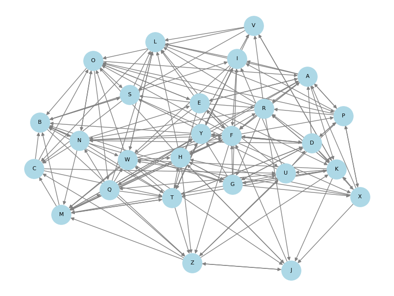

# Graph-Based Social Network Analysis for Influencer Detection

## Overview

This project presents a graph-based social network analysis approach for identifying influential users and discovering community structures in a social network.

The project was developed as part of the Big Data Analytics Lab and models a social network as a directed graph, where users are represented as nodes and interactions between users are represented as edges.

Graph analytics techniques are applied to analyze user influence, connectivity, bridge users, and community structures.

## Objectives

- Represent social network interactions as a directed graph.
- Identify influential users using PageRank.
- Measure user connectivity using Degree Centrality.
- Identify bridge users using Betweenness Centrality.
- Detect communities within the social network.
- Analyze the structure of the social network using graph analytics.
- Demonstrate the application of graph-based methods for influencer detection.

## Dataset

The project uses a social network edge-list dataset stored in `data.txt`.

Each line represents a directed interaction between two users:

source_user target_user

The source user represents the initiating node and the target user represents the connected node.

The dataset is used to construct the social network graph for subsequent graph analysis.

## Methodology

The analysis follows the following pipeline:

Social Network Data
        ↓
Data Preprocessing
        ↓
Graph Construction
        ↓
PageRank Analysis
        ↓
Degree Centrality Analysis
        ↓
Community Detection
        ↓
Betweenness Centrality Analysis
        ↓
Result Analysis

## Algorithms Used

### 1. PageRank

PageRank is used to estimate the relative importance or influence of users in the directed social network.

### 2. Degree Centrality

Degree Centrality measures how well-connected each user is within the network.

### 3. Community Detection

The project uses a greedy modularity-based community detection algorithm to identify groups of closely connected users.

### 4. Betweenness Centrality

Betweenness Centrality identifies users that act as bridges between different parts of the network.

## Big Data and Technology Context

The project was developed in the context of Big Data Analytics and includes an HDFS-based data storage environment as documented in the academic project report.

The current graph-analysis implementation uses Python and NetworkX for graph construction and analysis.

### Technology Stack

- Python
- NetworkX
- Hadoop HDFS
- Git / GitHub

## Results

The implemented analysis produced the following results:

| Analysis | Top User | Score |
|---|---|---:|
| PageRank | F | 0.060 |
| Degree Centrality | F | 0.840 |
| Betweenness Centrality | F | 0.099 |

The community detection analysis identified four communities in the analyzed network.

### Top Influencer

User `F` obtained the highest PageRank score of `0.060`.

### Most Connected User

User `F` obtained the highest Degree Centrality score of `0.840`.

### Top Connector

User `F` obtained the highest Betweenness Centrality score of `0.099`.

## Visualization

The generated social network graph is available in:

`outputs/social_network_graph.png`

## Project Structure

Graph-Based-Social-Network-Analysis/
│
├── data.txt
├── project.py
├── requirements.txt
├── .gitignore
│
├── outputs/
│   └── social_network_graph.png
│
└── report/
    └── BDA Lab-Mini Project-Report_Final.pdf

## How to Run

### 1. Clone the repository

git clone https://github.com/shashank-bhat10/Graph-Based-Social-Network-Analysis.git
cd Graph-Based-Social-Network-Analysis

### 2. Install the required package

pip install -r requirements.txt

### 3. Run the analysis

python3 project.py

The program calculates PageRank, Degree Centrality, community structures, and Betweenness Centrality and displays the results in the terminal.

## Future Improvements

- Process larger social network datasets.
- Integrate distributed graph processing using Apache Spark.
- Incorporate real-time social network data.
- Apply advanced graph analytics and Graph Neural Networks.
- Develop interactive result visualizations.
- Evaluate the approach on larger real-world social network datasets.

## Applications

The project can be applied to areas such as:

- Influencer detection
- Social network analysis
- Community identification
- Social media analytics
- Network structure analysis
- Recommendation systems

## Authors

**Shashank Bhat**  
B.Tech. Data Science & Engineering  
Manipal Institute of Technology, MAHE

**Sohan Sanil**  
B.Tech. Data Science & Engineering  
Manipal Institute of Technology, MAHE